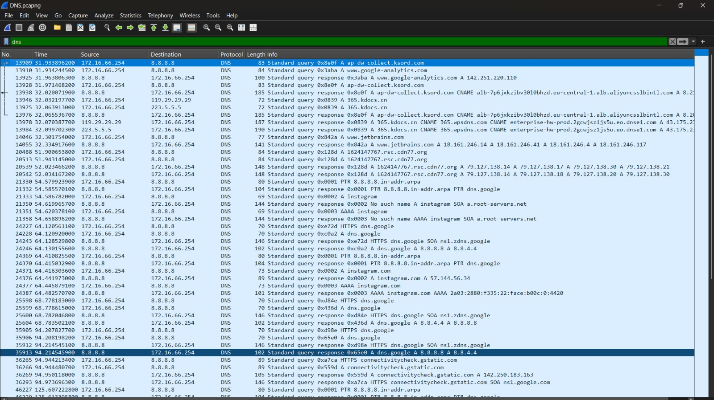
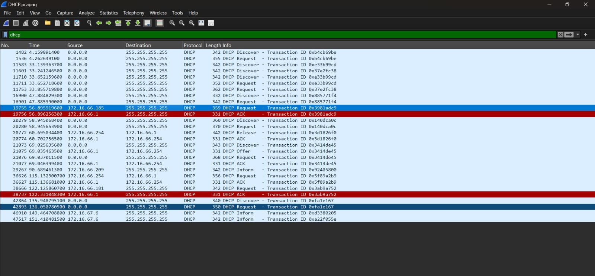
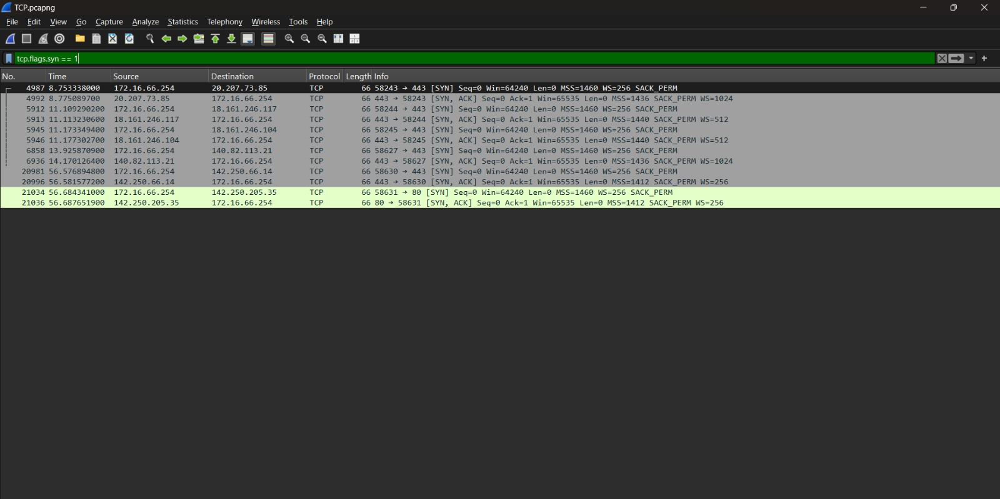
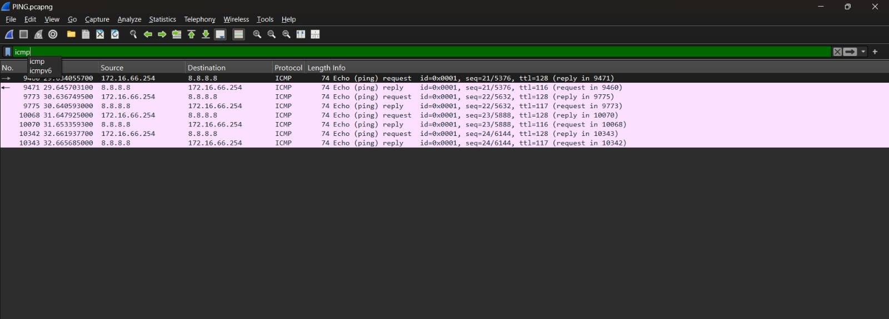
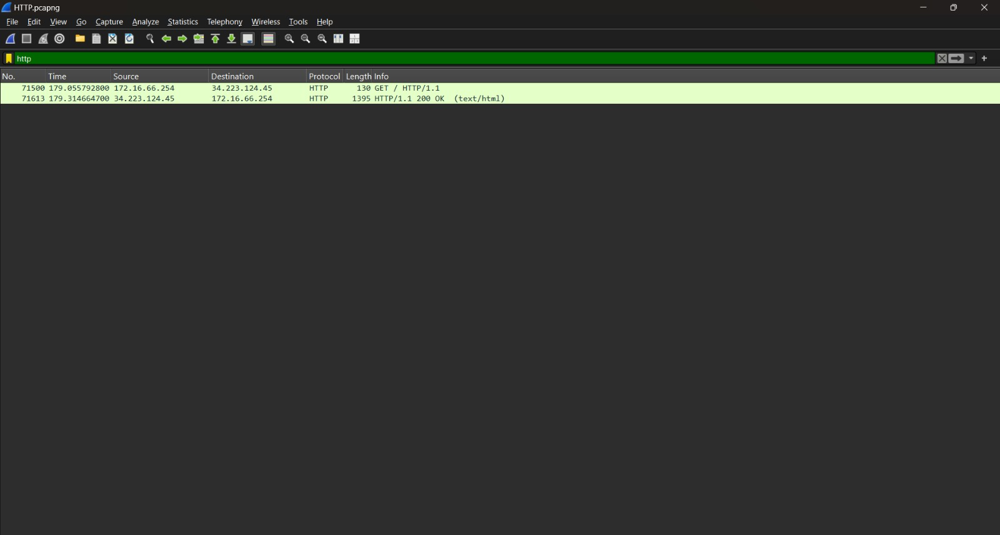
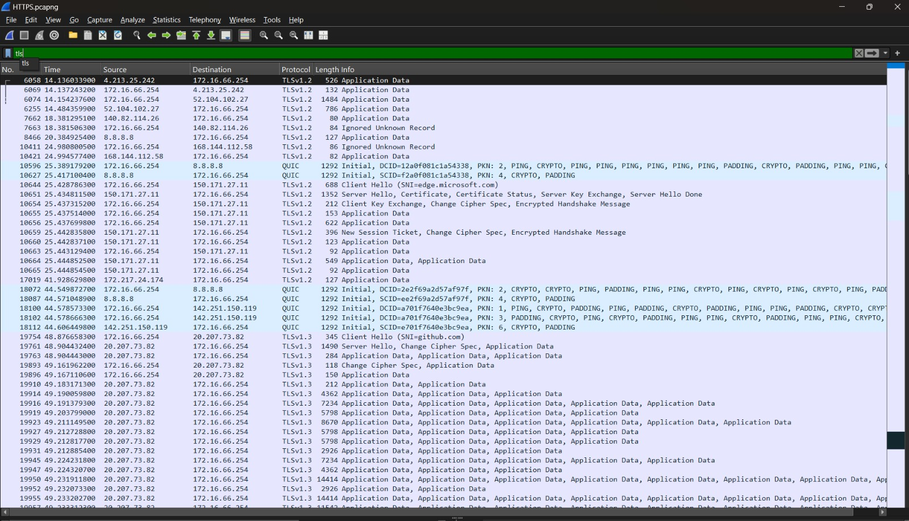
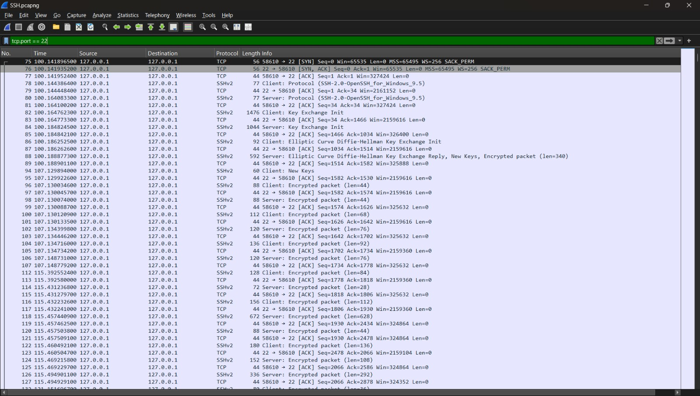

# Network Traffic Monitoring and Packet Analysis

## Purpose

The purpose of this project is to analyze network communication using packet capture and traffic analysis techniques.

## Project Description

Captured and analyzed different types of network traffic using **Wireshark** to understand protocol behavior, packet communication, and basic network troubleshooting techniques.

The following protocols were analyzed:

* DNS
* DHCP
* TCP
* ICMP
* HTTP
* HTTPS
* SSH

## Technologies Used

* Wireshark
* Network Packet Capture
* Packet Analysis

---

# Protocols Analyzed

## DNS

Analyzed DNS queries and responses to understand how domain names are resolved into IP addresses.

### Wireshark Capture



**Wireshark Filter:**

```text
dns
```

---

## DHCP

Captured DHCP traffic to understand how devices obtain IP addresses and other network configuration details.

DHCP communication was analyzed using the following sequence:

```text
Discover → Offer → Request → ACK
```

### Wireshark Capture



**Wireshark Filter:**

```text
dhcp
```

---

## TCP

Analyzed TCP communication and the TCP three-way handshake used to establish a reliable connection.

```text
SYN → SYN-ACK → ACK
```

### Wireshark Capture



**Wireshark Filter:**

```text
tcp
```

---

## ICMP / Ping

Analyzed ICMP traffic using the Ping command to understand network connectivity and Echo Request/Echo Reply packets.

Example command:

```text
ping 8.8.8.8
```

ICMP communication was observed using:

```text
Echo Request → Echo Reply
```

### Wireshark Capture



**Wireshark Filter:**

```text
icmp
```

---

## HTTP

Captured and analyzed HTTP requests and responses to understand unencrypted web communication.

### Wireshark Capture



**Wireshark Filter:**

```text
http
```

---

## HTTPS / TLS

Analyzed HTTPS/TLS traffic to understand encrypted web communication and identify TLS packets.

HTTPS encrypts application-layer data using TLS, so the actual web content is generally not visible in the packet capture.

### Wireshark Capture



**Wireshark Filter:**

```text
tls
```

---

## SSH

Captured and analyzed SSH traffic to understand secure remote communication between systems.

SSH provides encrypted communication between an SSH client and server.

### Wireshark Capture



**Wireshark Filter:**

```text
ssh
```

---

# Wireshark Filters

The following Wireshark display filters were used during packet analysis:

```text
dns
dhcp
tcp
icmp
http
tls
ssh
```

---

# Skills Covered

* Wireshark
* Network Traffic Analysis
* Packet Capture
* DNS Analysis
* DHCP Analysis
* TCP Analysis
* ICMP Analysis
* Ping Analysis
* HTTP Analysis
* HTTPS/TLS Analysis
* SSH Analysis
* Network Troubleshooting
* Wireshark Display Filters
* Packet Header Analysis

---

# Learning Outcomes

Through this project, I gained practical experience in:

* Capturing network packets using Wireshark
* Identifying different network protocols
* Analyzing packet headers and communication patterns
* Understanding TCP connections and three-way handshakes
* Troubleshooting network connectivity using ICMP/Ping
* Analyzing DNS queries and responses
* Understanding DHCP address assignment
* Analyzing HTTP requests and responses
* Identifying HTTPS/TLS encrypted traffic
* Analyzing SSH network communication
* Using Wireshark display filters for protocol-specific analysis
* Understanding basic network troubleshooting techniques

---

# Project Structure

```text
Network-Traffic-Monitoring/
│
├── README.md
│
├── captures/
│   ├── DNS.pcapng
│   ├── DHCP.pcapng
│   ├── TCP.pcapng
│   ├── ICMP.pcapng
│   ├── HTTP.pcapng
│   ├── HTTPS.pcapng
│   └── SSH.pcapng
│
└── screenshots/
    ├── DNS.jpeg
    ├── DHCP.jpeg
    ├── TCP.jpeg
    ├── ICMP.jpeg
    ├── HTTP.jpeg
    ├── HTTPS.jpeg
    └── SSH.jpeg
```

---

# Security & Privacy Note

Packet captures may contain sensitive network information such as:

* IP addresses
* MAC addresses
* Hostnames
* DNS queries
* Usernames
* Network infrastructure details
* Unencrypted application data

Only upload packet captures that are safe to share publicly.

For a public GitHub repository, screenshots are generally safer to publish than raw `.pcapng` files. Before uploading packet captures, review them in Wireshark and make sure they do not contain personal, private, or confidential information.

---

# Author

**Yuvasri**

---

⭐ If you found this project useful, consider giving the repository a star!
